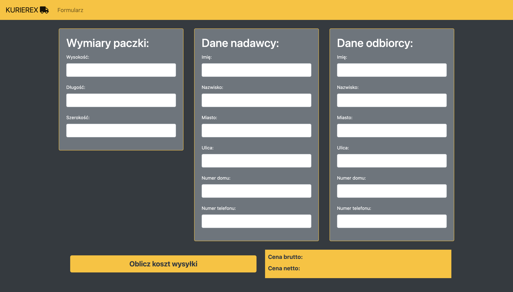

# Kurierex

### About the project
Kurierex is a website where you can calculate estimated cost of your delivery based on the dimensional weight algorithm. 
It is connected to our own API written in Java/Spring and Firebase realtime database to collect all the data from users.

### Build with
* Angular
* Bootstrap 5
* Toastr

## Getting started
### Prerequisities
* IDE 
* Web Browser

### For Local
1. Clone the repo
```sh
git clone https://github.com/sobusz/KurierexAngular.git
```

## Preview

### Starting page
<p align="center">
  
</p>

this is starting page of our app. It features custom navbar, beautiful background image, and box with button which redirects user to the form, which is the most important (and only) feature of this project.

### Form
<p align="center">
  
</p>

These 3 forms collect all necessary data from the user to calculate dimensional weight of the package, contact details of sender and receiver of the package.
Forms are validated and can't go through with any errors. If such thing happens, pop-up is being displayed. 
<p align="center">
  
</p>
